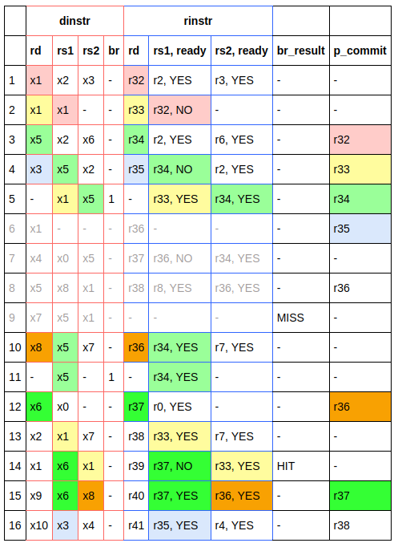

# MTH410E – RISC-V Architecture and Processor Design

## Rename Module

Write a Systemverilog code of a Rename module. The design should take instructions and change their architectural register ids to different physical register ids in order to prevent false register dependencies.

You can assume this module is a part of an single-issue out-of-order processor with in order commit. You can also assume no branch operation will be issued for the scope of this project. But if you want to add branching support (+20 bonus points) you can assume there will only 1 active branch operation at a time. If a second branch instruction comes, the processor will stall until the first branch instruction resolves. 

When a new instruction comes: 
- If the instruction has a valid destination register, the module should map architectural id of the destination register to a non-used physical register id and make sure the mapped physical register id won't be mapped by any other architecturel register id. If architectural destination register id is 0, then physical register id should also be 0.
- If the instruction has a valid source register, the module should find the last mapped physical register id for the architectural id of the source register and mark it as ready if the physical register is committed and not ready otherwise. If the commit signal for physical register file comes at the same cycle, then it should be marked as ready. 

You are expected to give renamed version of the input instructions at the same cycle. The commit signals for the renamed destination registers can come after random amount of cycles but in order. The module will be tested with simple operations such as "AND, ADD, ADDI, SUB, ... " but this module should work independent of the opcode. For simplicity, you can assume rd, rs1, and rs2 registers can be valid independently from each other. 

If there is no previously mapped physical register id for an architectural register id, then it can give any physical register id as output. For simplicity, you can map each architectural register id to a physical register id at rst_ni. If there is no usable physical register, then rn_full_o signal should give output with HIGH value. If rn_full_o signal is HIGH processor will stall and won't give any valid instruction to rename module.

If you want to support branch operations for extra points, a branch operation will be indicated with `is_branch` signal. Branch operation itself can be considered as same as other instructions but the instructions after that should consider that they can be flushed if a miss branch result comes. The module should adjust it's inner mappings so that instructions after the branch operation won't cause inconsistincies for the rest of the instructions.

The type definitions and top file of the Rename Module should be as follows;

### Type Definitions
```
typedef struct packed {
	logic       valid;  
	logic [4:0] idx;       	//id of the register
} a_reg_t;			//architectural register

typedef struct packed {
	logic       valid;
	a_reg_t     rd;		//only valid if rd used
	a_reg_t     rs1;	//only valid if rs1 used
	a_reg_t     rs2;	//only valid if rs2 used
	logic       is_branch;	//bonus
} dinstr_t;	                //decoded instruction


typedef struct packed {
	logic       valid;  
	logic [5:0] idx;    	//id of the new register
	logic       ready;  	// 
} p_reg_t;		        //physical register

typedef struct packed {
	logic       valid;
	p_reg_t     rd;
	p_reg_t     rs1;
	p_reg_t     rs2;
} rinstr_t;		        //renamed instruction

typedef struct packed {
	logic valid;
	logic hit;
} br_result_t;

```


### TOP Module
```
module rename(
	input  logic       clk,
	input  logic       rst_ni,
	input  br_result_t br_result_i,
	input  p_reg_t     p_commit_i,   //in-order commit
	input  dinstr_t    dinstr_i,
	output rinstr_t    rinstr_o,
	output logic       rn_full_o
);

	/* Your Code Here */
	//...
	//...
	//...

endmodule

```

### Example

The table below given as an example. Your rename module can choose any register id for the new instructions as long as it doesn't break consistency.


## Tasks:

1. Fill in the given `task1_rename_table.xlsx` file as given in the example. (This task is not dependent to rtl. You can fill the table differently from rtl)
2. Complete your RTL in `src/rename.sv` in SystemVerilog.
3. Clean all lint problems.
4. Make sure it successfully completes the testbench without any error.
